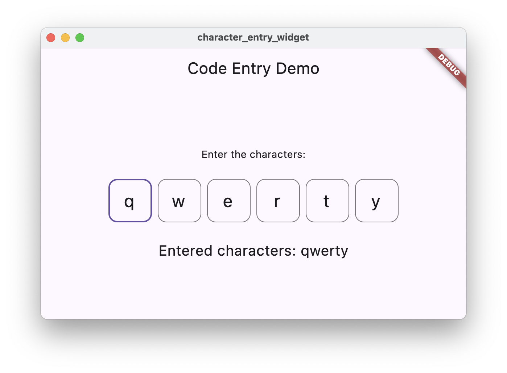

# Code Entry Field

A Flutter widget for entering single characters at a time in a series of boxes.



## Features

*   Enter single characters in a series of boxes.
*   Focus moves to the next box automatically.
*   Backspace clears the current box or moves to the previous box.
*   Tab and enter keys move focus to the next box.
*   Supports only letters and numbers.
*   Customizable number of character boxes.
*   Callback for when the characters change.

## Getting started

To use this widget, add `code_entry_field` as a [dependency in your pubspec.yaml file](https://flutter.dev/docs/development/packages-and-plugins/using-packages).


## Usage

```dart
import 'package:code_entry_field/code_entry_field.dart';

CodeEntryField(
  characterCount: 6,
  onChanged: (characters) {
    print(characters);
  },
  boxSize: Size(60,60) // Optional: default is 50.0, 50.0
  initialCharacters: ['A', 'B', 'C'], // Optional: default is empty
  style: CodeEntryFieldStyle.Default.copyWith( 
    boxBackgroundColor: Colors.grey.withAlpha(50),
  ), // Optional, uses default styling if not set
)
```

## Styling

The `CodeEntryField` widget can be styled using the `CodeEntryFieldStyle` class. This allows you to customize the appearance of the character boxes, including background color, border, selection color, and text style.

Static `CodeEntryFieldStyle.Default` offers default style for the widget.


```dart
import 'package:code_entry_field/code_entry_field.dart';
import 'package:flutter/material.dart';

CodeEntryField(
  characterCount: 6,
  onChanged: (characters) {
    print(characters);
  },
  style: CodeEntryFieldStyle(
    boxBackgroundColor: Colors.blue.withOpacity(0.1),
    boxBorderColor: Colors.blue,
    boxBorderWidth: 2.0,
    boxCornerRadius: 10.0,
    selectionColor: Colors.green.withOpacity(0.3),
    textStyle: const TextStyle(
      fontSize: 28,
      fontWeight: FontWeight.bold,
      color: Colors.deepPurple,
    ),
  ),
)
```

### `CodeEntryFieldStyle` Properties:

*   `boxBackgroundColor`: The background color of each character box.
*   `boxBorderColor`: The color of the border around each character box.
*   `boxBorderWidth`: The width of the border around each character box.
*   `boxCornerRadius`: The corner radius of box border
*   `selectionColor`: The color of the selection highlight when a box is focused.
*   `textStyle`: The text style for the characters entered in the boxes (font, size, weight, color, etc.).

